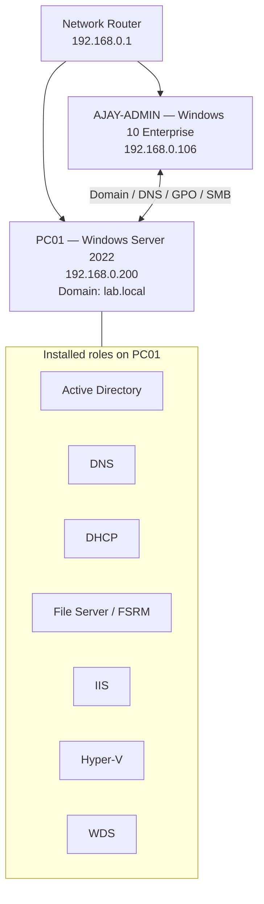

```mermaid 
flowchart TB
    R["Network Router<br/>192.168.0.1"]

    S["PC01 — Windows Server 2022<br/>192.168.0.200<br/>Domain: lab.local"]

    C["AJAY-ADMIN — Windows 10 Enterprise<br/>192.168.0.106"]

    subgraph Roles["Installed roles on PC01"]
      AD["Active Directory"]
      DNS["DNS"]
      DHCP["DHCP"]
      FS["File Server / FSRM"]
      IIS["IIS"]
      HV["Hyper-V"]
      WDS["WDS"]
    end

    R --> S
    R --> C
    S --- Roles
    C <-->|Domain / DNS / GPO / SMB| S
```
